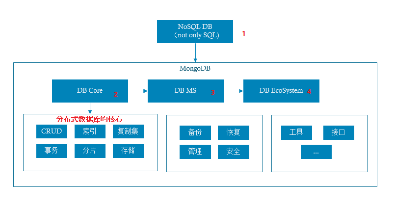
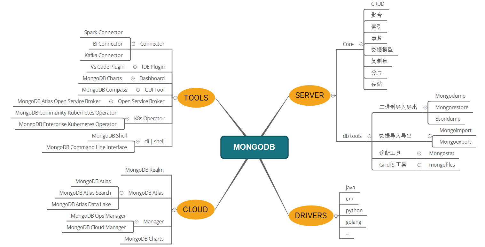
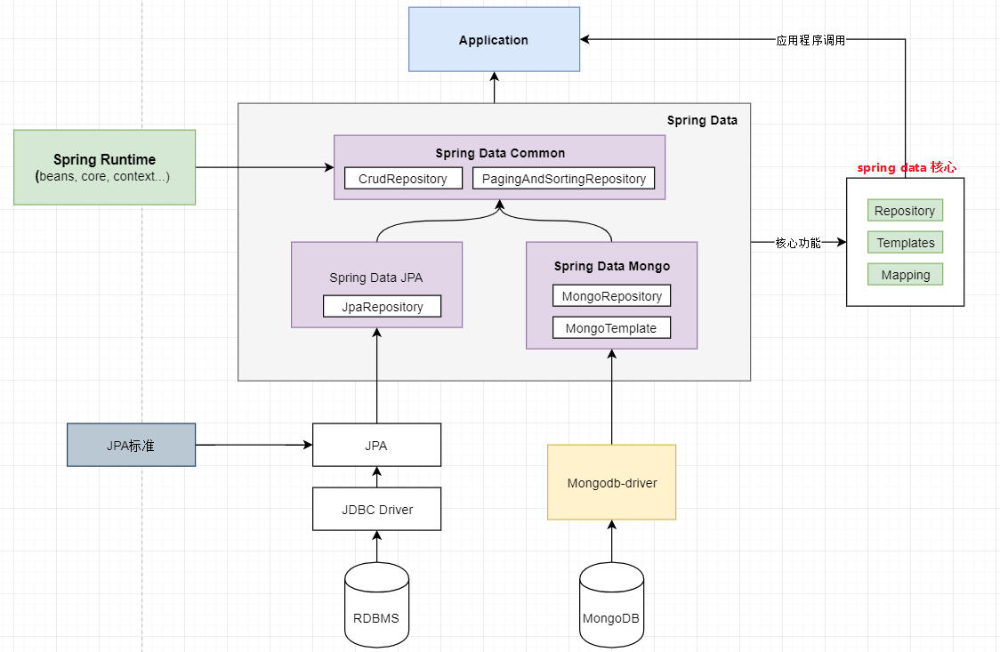

# MongoDB教程 - Mongo知识体系详解

著作权归https://pdai.tech所有。 链接：https://pdai.tech/md/db/nosql-mongo/mongo.html

> 本系列将给大家构建MongoDB全局知识体系。

## [¶](#知识体系) 知识体系

MongoDB学习引入

MongoDB生态

## [¶](#学习要点) 学习要点

> **1. MongoDB引入和生态介绍**： 首先了解NoSQL基本的概念以及MongoDB基础概念，进而引入MongoDB的生态。

- Mongo入门 - MongoDB基础概念
  - 在学习MongoDB之前先简单了解相关概念。
- Mongo入门 - MongoDB整体生态
  - 很多人在学习Mongo时仅仅围绕着数据库功能，围绕着CRUD和聚合操作，但是MongoDB其实已经基本形成了它自身的生态了。我们在学习一项技能时一定要跳出使用的本身，要从高一点的格局上了解整个生态，这样会对你构筑知识体系有很大的帮助。。

> **2. MongoDB入门 - 基本使用**： 开始学习MongoDB安装，使用等。

- Mongo入门 - 基本使用：安装和CRUD
  - 在理解MongoDB基础概念后，本文将介绍MongoDB的安装和最基本的CURD操作。
- Mongo入门 - 基本使用：索引和聚合
  - 在了解MongoDB的基本CRUD操作后，常用的其它操作还有对字段的索引以及对字段的聚合操作。
- Mongo入门 - 基本使用：效率工具
  - 本文将主要介绍常用的MongoDB的工具，这些工具可以极大程度的提升你的效率。
- Mongo入门 - 基本使用：Java 低阶API
  - 本文为低优先级，只是向你介绍下MongoDB提供的原生的JavaAPI；而大多数公司使用Spring框架，会使用Spring Data对MongoDB原生API的封装，比如JPA，MongoTemplate等。
- Mongo入门 - 基本使用：Spring Data + Mongo
  - 本文为主要介绍Spring Data对MongoDB原生API的封装，比如JPA，MongoTemplate等。以及原生API和Spring data系列之间的关系。

> **3. MongoDB进阶 - 原理和WiredTigger存储引擎**： 在学习完常用的基础之后，我们再看下MongoDB的原理和WiredTigger存储引擎。

- Mongo进阶 - MongoDB体系结构
  - 上面章节已经对MongoDB生态中工具以及使用有了基础，后续文章我们将开始理解MongoDB是如何支撑这些功能的。我们将从最基本的MongoDB的体系结构开始介绍，主要包括`MongoDB的包结构`，`MongoDB的数据逻辑结构`，`MongoDB的数据文件结构`。其中围绕着MongoDB的数据文件结构，将为我们后续介绍MongoDB的存储引擎详解打下基础。
- Mongo进阶 - 原理和WiredTiger引擎
  - 开始初步了解MongoDB实现原理和WiredTiger引擎。
- Mongo进阶 - WT引擎：数据结构
  - MongoDB的WiredTiger存储引擎背后采用了什么样的数据结构呢？本文将从`常见引擎数据结构`，`典型B-Tree数据结构`，`磁盘数据结构`, `内存数据结构`, `Page数据结构`等方面详解介绍。。
- Mongo进阶 - WT引擎：Page生命周期
  - 通过前文我们了解到数据以page为单位加载到cache; 有必要系统的分析一页page的生命周期、状态以及相关参数的配置，这对后续MongoDB的性能调优和故障问题的定位和解决有帮助。
- Mongo进阶 - WT引擎：checkpoint原理
  - Checkpoint主要有两个目的: 一是将内存里面发生修改的数据写到数据文件进行持久化保存，确保数据一致性；二是实现数据库在某个时刻意外发生故障，再次启动时，缩短数据库的恢复时间，WiredTiger存储引擎中的Checkpoint模块就是来实现这个功能的。

> **4. MongoDB进阶 - 数据库核心知识点**： 再者我们还学要进一步学习MongoDB的核心知识点。

- Mongo进阶 - DB核心：索引实现
  - 数据库核心知识点之索引
- Mongo进阶 - DB核心：复制集
  - 数据库核心知识点之复制集
- Mongo进阶 - DB核心：分片Sharding
  - 数据库核心知识点之复分片Sharding
- Mongo进阶 - DB核心：备份恢复
  - 数据库核心知识点之备份恢复

> **5. MongoDB进阶 - 数据模型设计**： 在真正使用中，需要知道如何设计数据模型。

- Mongo进阶 - 系统设计：数据模型
  - MongoDB使用文档数据模型。
- Mongo进阶 - 系统设计：模式构建
  - MongoDB使用文档数据模型具有内在的灵活性，允许数据模型支持你的应用程序需求, 灵活性也可能导致模式比它们应有样子的更复杂。这涉及到如何在MongoDB中设计数据库模式（schema），有一个严峻的现实，大多数性能问题都可以追溯到糟糕的模式设计。

> **6. MongoDB进阶 - 性能优化**： 最后基于上述知识点，我们再了解下常见的性能优化的方式。

- Mongo进阶 - 性能：查询聚合优化
  - 在MongoDB中通过查询聚合语句分析定位慢查询/聚合分析

## [¶](#学习资料) 学习资料

TIP

下面是一些学习MongoDB的参考资料。@pdai

### [¶](#官网资料) 官网资料

> 最好的资料在官网。

- [MongoDB官网  (opens new window)](https://www.mongodb.com)
- [MongoDB数据库文档  (opens new window)](https://docs.mongodb.com/manual/)
- [MongoDB 常用Shell  (opens new window)](https://docs.mongodb.com/manual/mongo/)
- [MongoDB CRUD  (opens new window)](https://docs.mongodb.com/manual/crud/)
- [MongoDB 聚合  (opens new window)](https://docs.mongodb.com/manual/aggregation/)
- [MongoDB 数据模型  (opens new window)](https://docs.mongodb.com/manual/core/data-modeling-introduction/)
- [MongoDB 事务  (opens new window)](https://docs.mongodb.com/manual/core/transactions/)
- [MongoDB 索引  (opens new window)](https://docs.mongodb.com/manual/indexes/)
- [MongoDB 安全  (opens new window)](https://docs.mongodb.com/manual/security/)
- [MongoDB 副本  (opens new window)](https://docs.mongodb.com/manual/replication/)
- [MongoDB 分片  (opens new window)](https://docs.mongodb.com/manual/sharding/)
- [MongoDB 管理  (opens new window)](https://docs.mongodb.com/manual/administration/)
- [MongoDB 存储  (opens new window)](https://docs.mongodb.com/manual/storage/)

### [¶](#入门系列) 入门系列

- [MongoDB菜鸟教程  (opens new window)](https://www.runoob.com/mongodb/mongodb-tutorial.html)
- [MongoDB入门教程  (opens new window)](https://www.w3cschool.cn/mongodb/mongodb-1uxs37ih.html)

## [¶](#其它) 其它

[Mongodb Geo2d索引原理](https://cloud.tencent.com/developer/article/1004794)